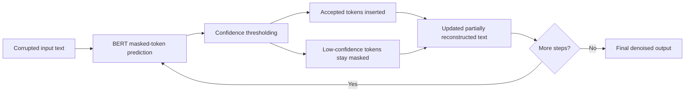

# Diffusion-Inspired Iterative Refinement for Small Language Models

## Page 1 — Problem Definition

**Task**

We study **text denoising** for small language models. The input is a corrupted sentence with missing or noisy tokens, and the model must reconstruct the original text.

**Example**

- Corrupted input: `homarus gammarus known the lobster, is a species from`
- Reference: `Homarus gammarus, known as the European lobster, is a species of clawed lobster from ...`

**Question**

Can a **diffusion-inspired iterative refinement process** help a small masked language model recover corrupted text better than a standard **one-pass BERT baseline**?

**What makes this hard**

- At high corruption rates, context becomes weak.
- One-pass masked prediction has only one chance to guess missing tokens.
- Iterative refinement could help, but it may also get stuck if the model is too conservative.

**Suggested visual**

Use a simple before/after reconstruction example with 3 rows:

1. corrupted text
2. iterative intermediate text
3. final output vs reference

---

## Page 2 — Motivation

**Typical approach**

Most small language models solve denoising in a **single pass**:

1. mask or corrupt input tokens
2. predict all missing positions once
3. stop

This is efficient, but it may fail when:

- many tokens are corrupted
- predicted context is uncertain
- the model needs multiple rounds to refine its guesses

**Gap**

Large diffusion-style text models suggest iterative denoising may be useful, but it is unclear whether a **small BERT-based masked language model** can benefit from the same idea in a lightweight setting.

**Our motivation**

We wanted to test whether:

- iterative refinement helps more than one-pass prediction
- more denoising steps improve reconstruction
- confidence thresholding changes the quality/coverage tradeoff
- scaling training data makes diffusion-style denoising more viable

**Main hypothesis**

Diffusion-style refinement should be most useful when the input is harder, especially under **moderate or high corruption**, provided the threshold and number of steps are tuned carefully.

---

## Page 3 — Main Ideas

**Core idea**

We build a **LLaDA-inspired**, BERT-based iterative denoiser:

- backbone: `bert-base-uncased`
- about **110M parameters**
- predicts masked tokens repeatedly instead of once

**What we investigated**

1. **Iterative refinement**
   - predict masked tokens over multiple steps

2. **Confidence thresholding**
   - accept a token only if model confidence exceeds a threshold

3. **Corruption-rate sensitivity**
   - evaluate low, medium, and high corruption

4. **Data scaling**
   - compare 4k, 16k, full usable WikiText-2, and 64k WikiText-103 training

**Why this might help**

- more steps give the model multiple chances to improve
- lower thresholds let the model make progress when context is weak
- more data may make iterative denoising more stable

**Important framing**

This is **LLaDA-inspired**, not a full LLaDA reproduction. We use a pretrained BERT denoiser with iterative inference rather than a fully timestep-conditioned diffusion language model.

---

## Page 4 — Method Details

**Inference procedure**

1. Start with a corrupted sentence containing masked positions.
2. Run BERT to predict masked tokens.
3. For each masked position:
   - if confidence >= threshold, accept the token
   - otherwise keep it masked
4. Repeat for a fixed number of refinement steps.
5. Return the final sequence.

**Hyperparameters explored**

- `threshold`: `0.5` to `0.9`
- `steps`: `1, 3, 5, 10, 15, 20, 25, 30, 65`
- `corruption_rate`: `0.1` to `0.7`

**Baseline**

- One-pass BERT denoising using the same backbone
- Predict once, no iterative refinement

**Training**

- diffusion-style masking objective over natural text
- checkpoints trained on:
  - 4k WikiText-2
  - 16k WikiText-2
  - full usable WikiText-2: **23,767** examples
  - 64k WikiText-103

**Block diagram**

---

## Page 5 — Evaluation Setup

**Datasets**

- `WikiText-2 raw`
- `WikiText-103 raw`

**Training scales**

- 4k examples
- 16k examples
- 23,767 usable examples from full WikiText-2 after filtering blank rows
- 64,000 examples from WikiText-103

**Evaluation task**

- **denoising**

**Metrics**

- **BLEU**
- **ROUGE-1**
- **ROUGE-L**
- **final_masked_tokens**
  - number of masked positions still unresolved at the end
- **final_mean_confidence**

**Why BLEU is not enough**

BLEU gives overlap quality, but it does **not** fully capture whether the output is complete or semantically correct. That is why we also track ROUGE and unresolved masked tokens.

**Training-scale result**

Use this graph:

**Key numbers**

- 4k WikiText-2: eval loss `3.729`
- 16k WikiText-2: eval loss `3.685`
- 23.8k WikiText-2: eval loss `3.526`
- 64k WikiText-103: eval loss `3.496`

**Takeaway**

The denoising objective improves steadily as we train on more data.

---

## Page 6 — Key Results

**Does diffusion beat baseline overall?**

- **No, not overall.**
- The one-pass baseline is still stronger on average.
- But diffusion becomes **competitive** and sometimes **better** in tuned settings.

**How much does scaling help?**

Use these graphs:

**Summary**

- 4k:
  - best BLEU delta: `+0.021`
  - positive settings: `19.4%`
- 16k:
  - best BLEU delta: `+0.076`
  - positive settings: `28.0%`
- full usable WikiText-2:
  - best BLEU delta: `+0.045`
  - positive settings: `31.7%`
- 64k WikiText-103:
  - best BLEU delta: `+0.092`
  - positive settings: `26.2%`

**Interpretation**

- Scaling data improves the **best-case performance** of diffusion strongly.
- The **most stable** model by percentage of positive settings is full usable WikiText-2.
- The **strongest peak result** comes from 64k WikiText-103.

**Best settings from today**

- Full usable WikiText-2:
  - `steps=20`, `threshold=0.6`, `corruption=0.3`
  - diffusion BLEU `0.3522`
  - baseline BLEU `0.3074`
  - delta `+0.0447`

- WikiText-103 64k:
  - `steps=25`, `threshold=0.8`, `corruption=0.3`
  - diffusion BLEU `0.3853`
  - baseline BLEU `0.2933`
  - delta `+0.0920`

---

## Page 7 — Analysis

**Where does diffusion help most?**

Use this graph:

**Pattern 1 — Corruption**

- Very low corruption (`0.1`) is already easy for baseline, so gains are smaller.
- Moderate corruption (`0.3`) is the clearest sweet spot.
- High corruption (`0.5` and above) sometimes gives larger gains, but the process becomes less stable.

**Pattern 2 — Threshold**

- Very high thresholds are often too conservative.
- Low or moderate thresholds let the model make progress.
- But very permissive thresholds can also lock in mistakes.

**Pattern 3 — Steps**

- More steps do **not** always help.
- Extra steps are useful only if the model is still confidently filling tokens.
- If threshold is too strict, more steps mostly preserve unresolved masks.

**Heatmap of the 64k sweet spot**

Use this graph:

This heatmap shows the clearest region of improvement at `corruption=0.3`. The strongest area is around:

- `threshold = 0.8`
- `steps = 25`

**Quality vs coverage tradeoff**

Use this graph:

**Important insight**

Some settings improve BLEU but still leave many masked tokens unresolved. This means:

- overlap quality may improve
- but reconstruction can remain incomplete

This is why `final_masked_tokens` is important alongside BLEU.

**Simple intuition**

- `corruption` = task difficulty
- `threshold` = model caution
- `steps` = model patience

If difficulty is high and caution is also high, the model can get stuck waiting instead of committing tokens.

---

## Page 8 — Conclusions and Future Work

**Main conclusions**

1. The one-pass BERT baseline remains **better overall**.
2. Diffusion-style iterative refinement becomes **competitive** and sometimes **better** in tuned settings.
3. More data clearly improves the denoising objective and raises the best-case diffusion results.
4. The most promising region is **moderate corruption with tuned thresholds and multiple refinement steps**.
5. Evaluation should not rely on BLEU alone; unresolved mask counts reveal important failure modes.

**Best final message**

Diffusion-style refinement is promising for small language models, but its success depends strongly on:

- training data scale
- threshold choice
- number of refinement steps
- corruption difficulty

**Limitations**

- This is not a full diffusion language model with timestep conditioning.
- Baseline still wins in most settings on average.
- Some high-gain settings still leave many unresolved masked positions.

**Future work**

- Add timestep conditioning
- Train on larger corpora and/or larger backbones
- Improve token-acceptance and remasking policies
- Extend experiments to infilling and generation
- Add stronger semantic evaluation beyond BLEU/ROUGE

**Poster close**

The project shows that iterative denoising is worth exploring for small language models, but careful sampler design is essential to make the gains reliable.
